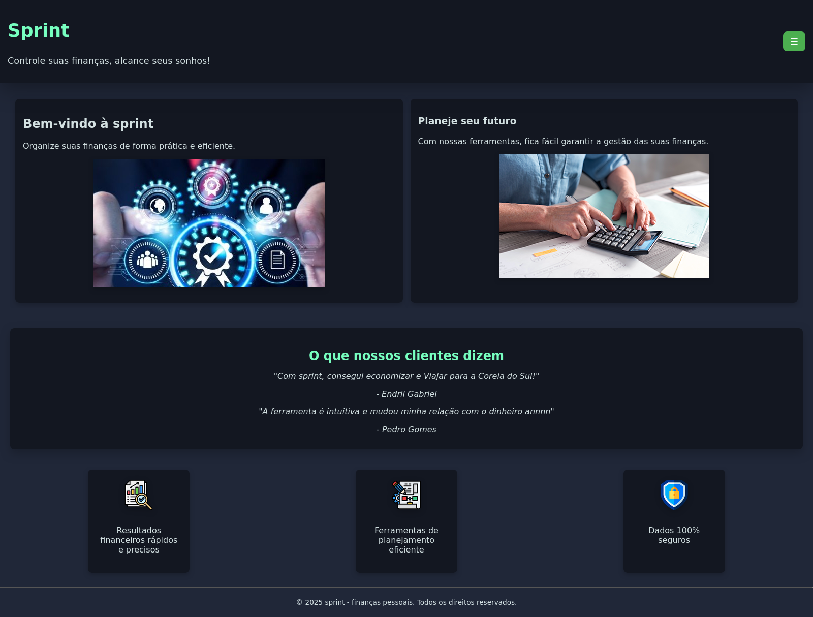
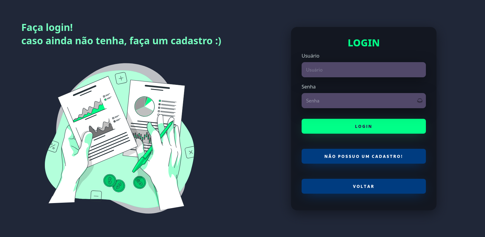
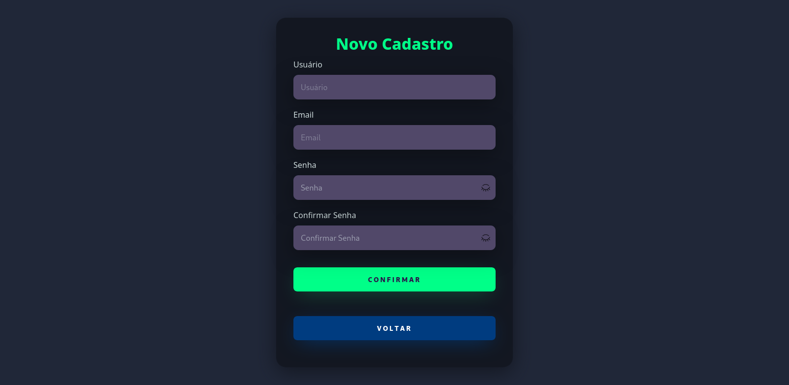
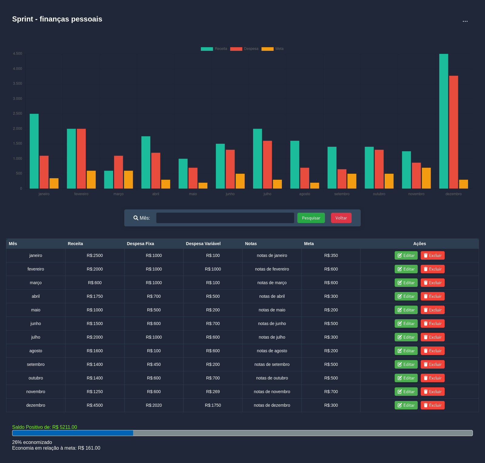
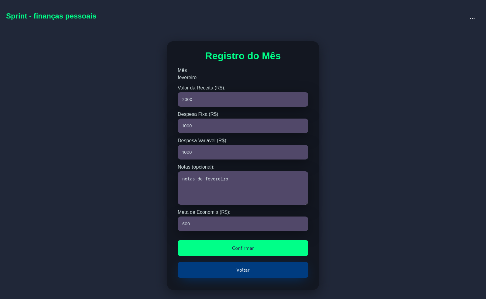
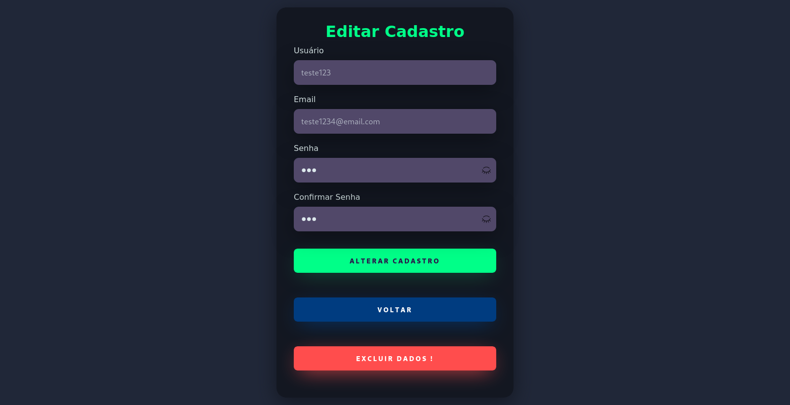

# JAVA-para-web

Sistema CRUD para Web desenvolvido com foco em tecnologias robustas para aplicações corporativas, utilizando **JSPs/Servlets**, **Hibernate**, **DAO**, **MVC** e **MySQL** para garantir organização, desempenho e manutenção facilitada.

---

## 🛠️ Tecnologias e Ferramentas Utilizadas

- **JSP (JavaServer Pages)** e **Servlets**: para a construção da interface web dinâmica e controle da lógica de requisições HTTP.
- **Hibernate**: framework ORM (Object-Relational Mapping) que facilita o mapeamento entre objetos Java e tabelas do banco de dados, abstraindo operações SQL complexas.
- **DAO (Data Access Object)**: padrão de projeto utilizado para abstrair e encapsular o acesso ao banco de dados, promovendo desacoplamento entre a lógica de negócios e persistência.
- **MVC (Model-View-Controller)**: arquitetura que separa a aplicação em três camadas, garantindo maior organização, escalabilidade e facilidade na manutenção.
- **MySQL**: banco de dados relacional utilizado para armazenamento persistente dos dados da aplicação.
- **HTML/CSS**: utilizados para construção das interfaces visuais, garantindo usabilidade e design responsivo.

---
✔️ Ferramentas e Ambiente

    Java – OpenJDK 21

    Maven – Gerenciador de dependências e build

    Msql – Banco de dados relacional

    Tomcat - servidor web que implementa as especificações Java Servlet, JavaServer Pages (JSP) 
    
    IDE – NetBeans
---

## 🖼️ Telas do Sistema

### 🏠 Tela Inicial
  
Tela principal de boas-vindas ao sistema.

---

### 🔐 Tela de Login
  
Tela para autenticação do usuário.

---

### 🧾 Tela de Cadastro de Usuário
  
Formulário para cadastro de novos usuários.

---

### 💰 Tela de Controle Financeiro
  
Exibe dados financeiros para controle do usuário.

---

### 📅 Tela de Registro de Mês
  
Interface para registrar informações mensais.

---

### ✏️ Tela de Edição do Mês
  
Tela para editar os dados registrados do mês.

---

### 👤 Tela de Edição do Usuário
  
Tela para editar dados do usuário.

---

## 🚀 Próximos Passos

- Finalizar integração do CRUD na tela de gestão financeira.
- Implementar validações e segurança na autenticação.
- Testar todas as funcionalidades em ambiente local e remoto.

---

## ⚠️ Observação

Este projeto está em desenvolvimento contínuo, e poderão ocorrer mudanças e reestruturações na arquitetura MVC para melhor adaptação às necessidades e melhorias do sistema.

---

